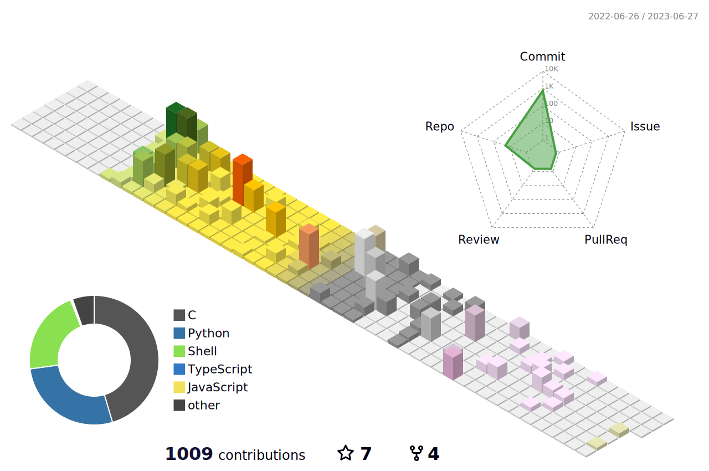

<h1>
  Hey there
  
  , I'm Lily .
</h1>

<!-- lol
**LilyCrown999/LilyCrown999** is a ✨ _special_ ✨ repository because its `README.md` (this file) appears on your GitHub profile.

Here are some ideas to get you started:

- 🔭 I’m currently working on ...
- 🌱 I’m currently learning ...
- 👯 I’m looking to collaborate on ...
- 🤔 I’m looking for help with ...
- 💬 Ask me about ...
- 📫 How to reach me: ...
- 😄 Pronouns: ...
- ⚡ Fun fact: ...
-->

- 🔭 I’m currently working on improving my coding 😀😁.
- 🌱 I’m currently learning python.
- 👯 I’m looking to collaborate on open-source projects.
- ⚡ Fun fact: GitHub says JavaScript is the Most Popular language in the world. 

#

##

